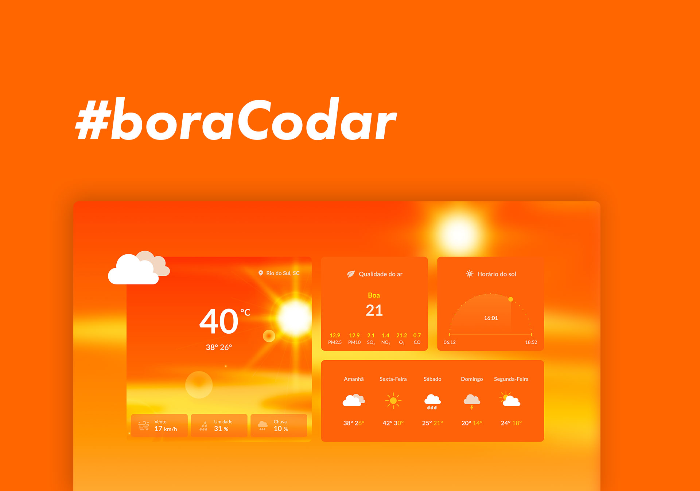

<h1 align="center"> ☀️🌧️ Uma página de clima ⛅❄️ </h1>

<p align="center">
<a href="https://www.rocketseat.com.br/boracodar">#boraCodar</a> são desafios promovidos pela <a href="https://www.rocketseat.com.br/">Rocketseat</a> para ensinar tecnologias WEB de forma prática e dinâmica. <br/>
</p>

<br>

<p align="center">
  
</p>

## 🚀 Tecnologias

Esse projeto foi desenvolvido com as seguintes tecnologias:

- HTML e CSS
- Figma para prototipação

## 📚 O que aprendemos neste desafio

- Estrutura e manipulação de Grid (grid-column, grid-row e linhas virtuais)
- Práticas de responsividade
- Utilização do `max-content`
- Alinhamento com `position:absolute`
- Alinhamento de divs usando Grid e Margin
- Propriedade `flex: 1`
- Uso de variáveis no CSS (`--variables`)
- Manipulação de transformações no CSS (calculo de graus com `deg`, `transform`, `rotate`, e `translate`)
- Aplicação de `mask` e `linear-gradient` para efeitos visuais

## 🌎 Demonstração

Você pode conferir o projeto ao vivo [aqui](#).

## 🔧 Como executar o projeto

```bash
# Clone este repositório
git clone https://github.com/seu-usuario/repositorio.git

# Abra o arquivo index.html no seu navegador